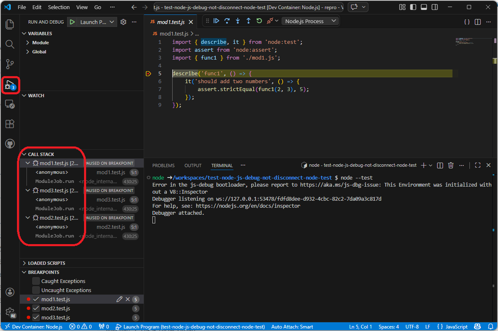
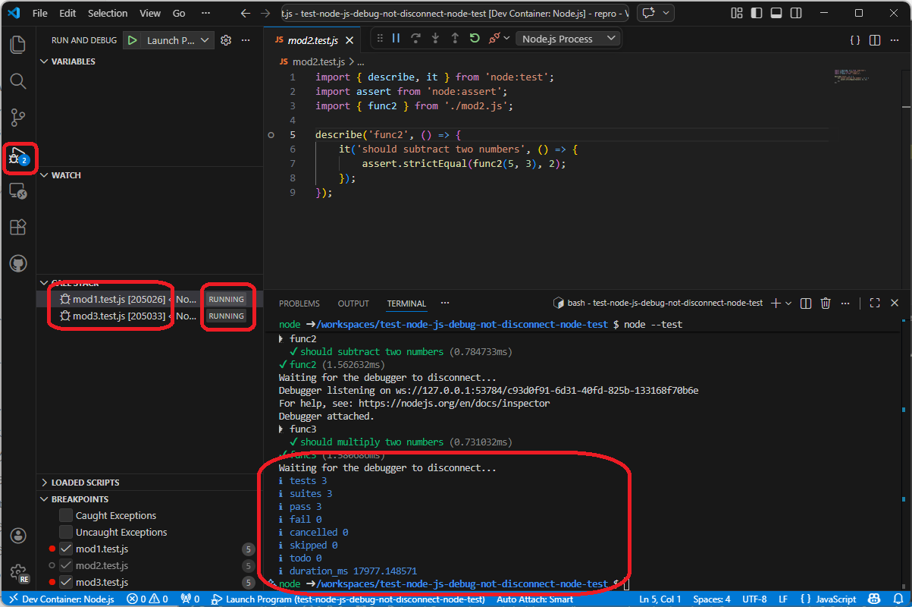
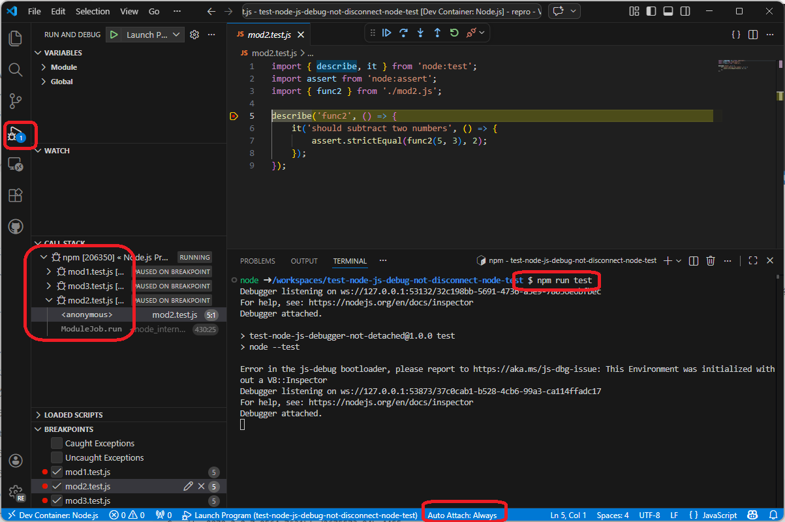
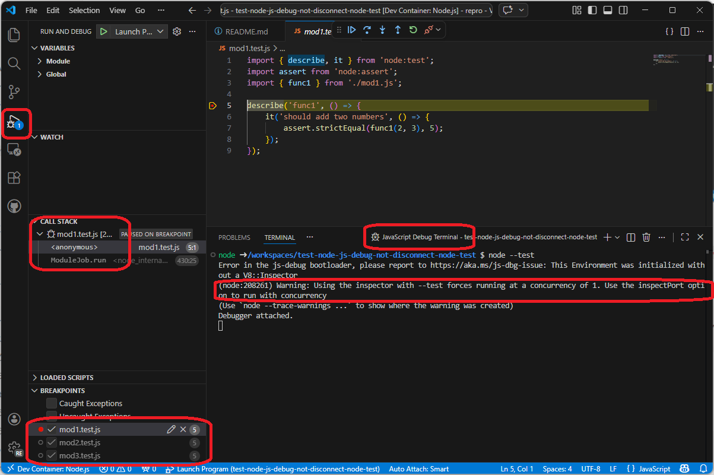

# test-node-js-debug-not-disconnect-node-test

Node.js 組み込みテストランナー CLI を利用しているとき、VS Code の js-debug セッションンが正しく切断されないことを再現するリポジトリ。

## 再現手順

1. Node.js が利用できる環境（WSL2 または Dev Container）でリポジトリを Clone。
2. VS Code の WSL 拡張機能で開く、または Dev Container として開く。
3. `Debug: Toggle Auto Attach` で `Smart`（または `Always`）を選択する。
4. integrated terminal を開く。
5.  `node --test` を実行する。
6. 10 回程度繰り返す。





## 備考

テストランナー CLI 自体は（おそらく）Node.js 内部スクリプトのため自動設足がスキップされ、その結果、テストスクリプトを実行する Node プロセス群がプロセスツリー上の最上位としてデバッグ接続され、複数セッションが同時に開始されることがある。この時に症状（終了後も RUNNING が残る）が発生する。

なお、Auto Attach を **Always** にして npm scripts 経由で `node --test` を実行すると、npm scripts のプロセスが最上位として接続されてセッションが1つになり、この問題は発生する。




また、JavaScript Debug Terminal では `--inspect`（ポート指定なし）扱いにより `--test-concurrency=1` が強制され、同時セッション開始が起きにくいため、この問題は発生しない。

```
(node:13350) Warning: Using the inspector with --test forces running at a concurrency of 1. Use the inspectPort option to run with concurrency
```



## 環境

IDE
```
Version: 1.112.0 (user setup)
Commit: 07ff9d6178ede9a1bd12ad3399074d726ebe6e43
Date: 2026-03-17T18:09:23Z
Electron: 39.8.0
ElectronBuildId: 13470701
Chromium: 142.0.7444.265
Node.js: 22.22.0
V8: 14.2.231.22-electron.0
OS: Windows_NT x64 10.0.26200
```
